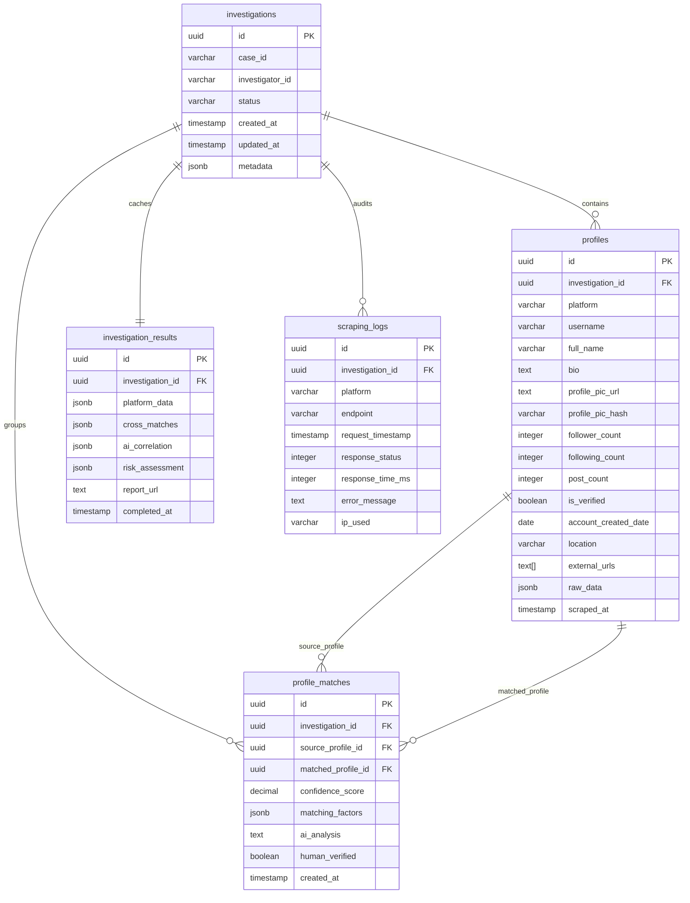

# AI-OSINT Database ERD

```mermaid
erDiagram
    investigations ||--o{ profiles : contains
    investigations ||--o{ profile_matches : groups
    investigations ||--|| investigation_results : caches
    investigations ||--o{ scraping_logs : audits
    profiles ||--o{ profile_matches : source_profile
    profiles ||--o{ profile_matches : matched_profile

    investigations {
        uuid id PK
        varchar case_id
        varchar investigator_id
        varchar status
        timestamp created_at
        timestamp updated_at
        jsonb metadata
    }

    profiles {
        uuid id PK
        uuid investigation_id FK
        varchar platform
        varchar username
        varchar full_name
        text bio
        text profile_pic_url
        varchar profile_pic_hash
        integer follower_count
        integer following_count
        integer post_count
        boolean is_verified
        date account_created_date
        varchar location
        text[] external_urls
        jsonb raw_data
        timestamp scraped_at
    }

    profile_matches {
        uuid id PK
        uuid investigation_id FK
        uuid source_profile_id FK
        uuid matched_profile_id FK
        decimal confidence_score
        jsonb matching_factors
        text ai_analysis
        boolean human_verified
        timestamp created_at
    }

    investigation_results {
        uuid id PK
        uuid investigation_id FK
        jsonb platform_data
        jsonb cross_matches
        jsonb ai_correlation
        jsonb risk_assessment
        text report_url
        timestamp completed_at
    }

    scraping_logs {
        uuid id PK
        uuid investigation_id FK
        varchar platform
        varchar endpoint
        timestamp request_timestamp
        integer response_status
        integer response_time_ms
        text error_message
        varchar ip_used
    }
```
